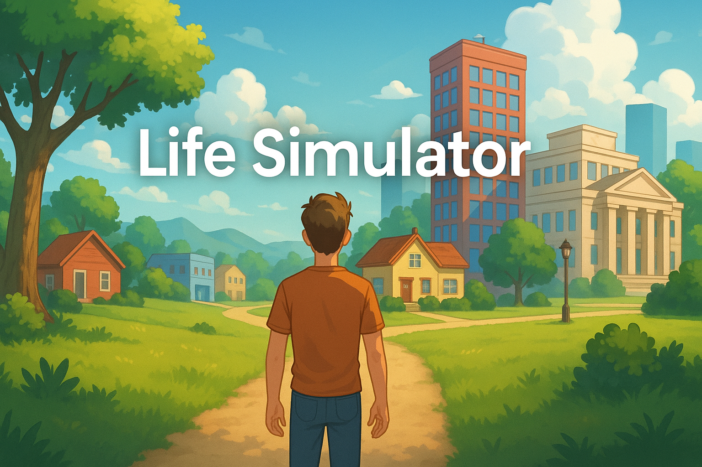

# 🌌 Life simulator

## 🧩 Principe général

**Life simulator** est un jeu narratif interactif où l'utilisateur est l'héro. À chaque étape clé de sa vie, l'utilisateur prend des décisions qui affectent son parcours et ses variables de vie (comme sa passion, sa clarté d'esprit et sa motivation).

Chaque choix a un impact direct sur les variables de progression du joueur et modifie les options disponibles à l'avenir. Le jeu met l'accent sur **les moments de doute, d'échec et de résilience**.

---

## Table des matières
- [Principe général](#principe-général)
- [Structure narrative](#structure-narrative)
- [Architecture technique](#architecture-technique)
  - [Back-end (Laravel API)](#back-end-laravel-api)
  - [Front-end (Vue.js)](#front-end-vuejs)
- [Fonctionnalités](#fonctionnalités)
- [Installation](#installation)
  - [Prérequis](#prérequis)
  - [Back-end](#installation-du-back-end-laravel-api)
  - [Front-end](#installation-du-front-end-vuejs)
- [Lancement de l'application](#lancer-lapplication)
- [Contribution](#contribution)
- [Licence](#licence)


---

## 📚 Structure narrative

Le jeu se divise en plusieurs **chapitres**, chacun représentant une période de la vie de l'utilisateur. Chaque chapitre contient des **choix** qui influent sur la **suite de sa vie** (argent, stress, bonheur, etc.) et les **variables de progression** (passion, motivation, clarté).

- **Chapitre = période de la vie** (ex : enfance, adolescence, carrière, retraite)
- **Choix = décisions importantes** (ex : choisir sa filière d’études, accepter un emploi, se lancer dans une relation, etc.)
- **Variables de progression** :
  - `passion` : ton feu intérieur, tes envies profondes.
  - `motivation` : ton énergie à faire des efforts.
  - `clarté d'esprit` : ta lucidité sur ton avenir, ta vision.

---

## ⚙️ Architecture technique

### Back-end (Laravel API)

- **Modèle `Chapter`** : Étapes de la vie, chaque chapitre contient un contenu narratif et des options de choix.
- **Modèle `Choice`** : Actions disponibles à chaque chapitre, avec des effets définis sur les variables de vie.
- **Modèle `UserProgress`** : Effets d’un choix sur les variables (par exemple : augmentation ou diminution de la `motivation`).

---

### Front-end (Vue.js)

- **Interface mobile-first** : Conçue pour être fluide et responsive.
- **Sidebar** : Affiche les variables de progression en temps réel.
- **Chapitres dynamiques** : Contenu du chapitre et choix disponibles sont chargés dynamiquement.
- **Feedback après chaque choix** : Affiche une évolution des statistiques et des choix précédents.

---

## Fonctionnalités

- **Sauvegarde automatique** : L'état du jeu est sauvegardé à chaque décision, permettant de reprendre la partie où vous l'avez laissée.
- **Fin multiple** : Le jeu offre différentes fins en fonction du niveau de bonheur, d'argent et de motivation à la retraite.
- **Système de statistiques** : Chaque choix affecte des variables comme la passion, la motivation et la clarté.

---

## Installation

### Prérequis

- PHP >= 7.4
- Composer
- Node.js (pour le front-end Vue.js)
- SQLite ou une base de données compatible

## Variables d’environnement

Copiez `.env.example` en `.env` et configurez :

```dotenv
DB_CONNECTION=sqlite
DB_HOST=127.0.0.1
DB_PORT=3306
DB_DATABASE=nom_de_votre_bdd
DB_USERNAME=votre_utilisateur
DB_PASSWORD=votre_mot_de_passe
```

## Installation du back-end (Laravel API)

1. Clonez le repository :

    ```bash
    git clone https://github.com/escalopeviandehache/life-simulator-kd.git
    cd life-simulator-kd-main
    ```

2. Installez les dépendances npm :

    ```bash
    npm install
    ```

3. Installez les dépendances PHP avec Composer :

    ```bash
    composer install
    ```

4. Configurez votre `.env` :

    ```bash
    cp .env.example .env
    php artisan key:generate
    ```

5. Exécutez les migrations pour créer les tables nécessaires :

    ```bash
    php artisan migrate --seed
    ```

## Installation du front-end (Vue.js)

1. Accédez au dossier  du projet :

    ```bash
    cd life-simulator-kd-main
    ```

2. Installez les dépendances npm :

    ```bash
    npm install
    ```

3. Compilez le projet :

    ```bash
    npm run build
    ```

## Lancer l'application

1.1 **Démarrer le back-end**  
   ```bash
   cd life-simulator-kd-main
   php artisan serve
   ```  
   par défaut sur http://127.0.0.1:8000

1.2 **Démarrer le front-end**  
   ```bash
   cd life-simulator-kd-main
   npm run serve
   ```  
   par défaut sur http://127.0.0.1:8080

2.0 **Démarrer le front-end et le back-end**  
   ```bash
   cd life-simulator-kd-main
   composer run dev
   ```  
   par défaut sur http://127.0.0.1:8000 et http://127.0.0.1:8080

3.0 **Se connecter pour tester**
```bash
email : admin@example.com
password : password
```
ou 
```bash
email : kd@example.com
password : password
```
ou
```bash
créer son propre utilisateur
```
---

## 🎮 Tester l'application

1. Créez un nouvel utilisateur ou connectez-vous si vous avez déjà un compte.
2. Commencez votre parcours en choisissant un chapitre de la vie.
3. Prenez des décisions et observez l'impact de vos choix sur vos statistiques de vie.
4. Explorez les différentes fins possibles en fonction de votre progression.


---

## 📝 Contribution

Les contributions sont les bienvenues ! N'hésitez pas à soumettre des issues ou des pull requests pour améliorer ce projet.

---


